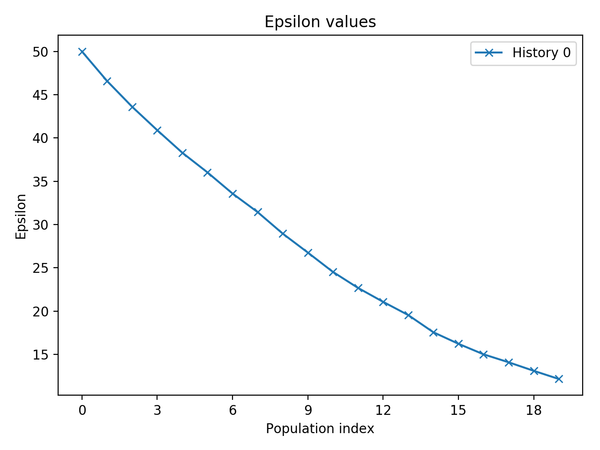

# Weekly notes from 20 May

## Try more data points

-   Design
    -   Default
    -   `array([ 0.  ,  0.25,  0.5 ,  1.  ,  2.  ,  4.  ,  6.  ,  8.  , 10.  ,12.  , 14.  , 16.  , 18.  , 20.  , 22.  , 24.  , 28.  , 32.  , 36.  , 40.  , 44.  , 48.  , 52.  , 56.  , 60.  , 64.  , 68.  , 72.  ])`
    -   28 time points, 28*4=112 values in data

**DONE**

## Reset the initial parameters

-   Fit the data to get a least square parameters?
    -   Some lm fit not support multi variables LS
-   Turn to AMC-SMC for initial rough inference
    -   Initial population seems to take forever
    -   Code in `InitPara.py`
    -   The mean value of last population is quiet different from the peak value
        -   Use peak value?
        -   Use sum of value*weight **<- now chosen**

>   Issue spotted
>
>   -   Python 3.8.2 with pyABC will produce an error on the `model` parameter. Further attention should be paid.
>   -   Solution: use the old environment python 3.7
>
>   Bug spotted
>
>   -   Euclidean distance function return `NaN` in the test, which might bring the above problem “Initial population seems to take forever”
>   -   Solution: check the distance function. Unit test should also be modified to accommodated this

Result of `mean()`

```
iBM         9.737715
kMB        47.458632
kNB         9.973562
lambdaM    39.107247
lambdaN    25.262527
muA        47.041885
muB        15.762823
muM        39.539603
muN        79.994190
sAM        38.563204
sBN        37.618288
vNM        13.229111
```

Result of `df*w.sum()`:

```
iBM				9.051270
kMB       40.881926
kNB       9.618762
lambdaM   41.405661
lambdaN   29.360990
muA       44.426018
muB       16.450285
muM       37.356256
muN       78.150011
sAM       33.580249
sBN       41.486109
vNM       13.005909
```

Result of maximal weighted particle:

```
iBM         6.706790
kMB        37.790301
kNB        13.288773
lambdaM    40.238402
lambdaN    45.633238
muA        39.136272
muB        15.821665
muM        34.883162
muN        77.583389
sAM        40.198178
sBN        32.110228
vNM        12.689222
```

Plot: not well fitted


-   Back to scipy LS fitting again
    -   Two LS function `curve_fit` and `least_squares` were tried, with different boundary conditions and initial guesses 
    -   Visualisation used to select a parameter set that generates data that are close to real data
-   `paraGuess = [2]*12`，

```
'iBM': 2.4041603100488587,
'kMB': 0.14239564228380108,
'kNB': 2.3405757296708396,
'lambdaM': 1.9508302861494105,
'lambdaN': 2.5284489000168113,
'muA': 2.715326160638292,
'muB': 0.35008723255144486,
'muM': 0.1603505707251119,
'muN': 2.2016772634585147,
'sAM': 1.387525971337514,
'sBN': 1.202190024316036,
'vNM': 0.5119068430635925
```


# Weekly notes from 25 May

-   Studied the ABC-SysBio package again `paper.md`
-   Make some code separate functions in separate files
-   Make a visualisation
    
    -   Mean, 25 and 75 percentiles
    
    >   Convergence can be assessed by the difference using the inter-quartile ranges of the values of accepted particles as a measure of goodness of fit between successive intermediate distributions (Toni et al., 2009).


-   Reset the ODE initial value
-   Reformat the `dict` data to use the built-in distance function
    -   Old: `N: data of N, ...`
    -   New: `0: value of N[0], ..., 111: value  of A[27]`


-   **Distance function**

    -   Built-in function does not support data with `NaN`

    -   Tried to modify the source code: `sum` and `max` etc to `np.nansum` and `np.nanmax`

    -   `PNormDistance` parameters

        -   p for p-norm
        -   Weigh: weights specified at each time points that are used to weight the p-norm at different statistics. **Pre-fixed** for all timepoints and statistics to be compared

        $$
        d(x, y) = \
                \left [\sum_{i} \left| w_i ( x_i-y_i ) \right|^{p} \right ]^{1/p}
        $$

        

    -   pyABC adaptive distance: 

        Prangle, Dennis. "Adapting the ABC Distance Function”. Bayesian Analysis, 2017. doi:10.1214/16-BA1002.

>   TypeError: unsupported operand type(s) for ** or pow(): 'generator' and 'float'

-   Read paper related to adaptive function: 

    Optimizing threshold - schedules for approximate Bayesian computation sequential Monte Carlo samplers: applications to molecular systems. Preprint at http://arxiv.org/abs/1210.3296 (2012).

    See `paper.md`

-   Source code modified: `distance.py`, line 97
    
    -   Tested with/without NaN
    -   **?** Possible impact to performance? (numpy supports parallel well)

Nan version: **tested**

```python
            d = 0
            for key in w:
                if key in x and key in x_0:
                    if np.isnan(x[key]) or np.isnan(x_0[key]):
                        continue;
                    d+=pow(abs((f[key] * w[key]) * (x[key] - x_0[key])), self.p)
                else:
                    d+=0
            d = pow(d, 1 / self.p)
            # d = pow(
            #     sum((pow(abs((f[key] * w[key]) * (x[key] - x_0[key])), self.p)
            #               if key in x and key in x_0 else 0
            #               for key in w)),
            #     1 / self.p)
```
New version: **tested**

```python
# New version

            d = pow(
                sum((pow(abs((f[key] * w[key]) * (x[key] - x_0[key])), self.p)
                          if (key in x) and (key in x_0) and (not np.isnan(x[key])) and (not np.isnan(x_0[key])) else 0
                          for key in w)),
                1 / self.p)
```

-   Possible problem: running modified packages on ARCHER

-   Using the modified distance function

    -   Build new ls fitting: `paraGuess = [2]*12` for inferring back

    ```
    {'iBM': 8.475862809697531,
     'kMB': 3.7662920313110075,
     'kNB': 2.2961320437266535,
     'lambdaM': 8.509867878209329,
     'lambdaN': 1.5114114729225983,
     'muA': 5.903807936902964,
     'muB': 0.38726153092588084,
     'muM': 3.697974670181216,
     'muN': 2.6821274451686814,
     'sAM': 3.62381585701928,
     'sBN': 3.7176297747866545,
     'vNM': 0.4248874922862373}
     and 
     {'iBM': 1.0267462374320455,
                 'kMB': 0.07345932286118964,
                 'kNB': 2.359199465995228,
                 'lambdaM': 2.213837884117815,
                 'lambdaN': 7.260925726829641,
                 'muA': 18.94626522780349,
                 'muB': 2.092860392215201,
                 'muM': 0.17722330053184654,
                 'muN': 0.0023917569160019844,
                 'sAM': 10.228522400429998,
                 'sBN': 4.034313992927392,
                 'vNM': 0.3091883041193706}
    ```

-   Adaptive distance: https://pyabc.readthedocs.io/en/latest/examples/adaptive_distances.html
    
    -   Trivial Euclidean distance function assign every data point with equal weight

>   In each iteration of the ABCSMC run, after having obtained the desired number of accepted particles (and once at the beginning using a sample from the prior), the method `DistanceFunction.update()` is called. It is given a set of summary statistics which can be used to e.g. compute weights for the distance measure in the next iteration. In order to avoid bias, via `DistanceFunction.configure_sampler()`, the distance function can tell the sampler to not only record accepted particles, but all that were generated during the sampling process. So, when you want to define your own adaptive distance function, you will typically only need to overwrite these two methods. For implementation details and an example of how this can look in practice, please inspect the code of `AdaptivePNormDistance`.

-   `acceptor = pyabc.UniformAcceptor(use_complete_history=True)`
    -   To get nested acceptance regions. It means that also all previous acceptance criteria are re-applied. This is optional here but may be beneficial sometimes
    -   **?**
-   **Adaptive distance is not always better**
    -   Maker it robust:
        -   `scale_function=pyabc.distance.root_mean_square_deviation`
    -   Does not give a better fit than non-adaptive function
        -   More tweaking?

## Measure/evaluate the goodness of fit

-   The required number of samples
    
    -   `pyabc.visualization.plot_sample_numbers(histories, labels)`
    
-   Effective sampling size (**ESS**) of ABC-SMC runs

-   Plots:
    
    -   Marginal posterior distribution vs true value for each parameter
    -   **DONE** in `result_plot`, e.g.
    
    
    
    
    
    
    
    

-   Paper read: `Approximate Bayesian Computation for infectious disease modelling`
    -   Three examples of ABC implementation 
    -   ESS can be used as threshold for stop condition, e.g. N/2

## Kernels

Listed in ABC-SysBio:

-   Uniform
-   Normal
-   Multivariate normal
-   Multivariate normal K neighbour (**MNN**)
-   Multivariate normal OCM

Trade-offs:

>   A perturbation kernel with a wide variance will stop the algorithm from being stuck in local modes, but will lead to a large number of particles being rejected, and thus cause the algorithm to be inefficient. 
>
>   Minter, A., & Retkute, R. (2019). Approximate Bayesian Computation for infectious disease modelling. *Epidemics*, *29*(February), 100368. https://doi.org/10.1016/j.epidem.2019.100368
>
>   Mentioned: **multivariate normal** and **MNN**
>
>   -   For MNN, normalised Euclidean distance can be used 
>
>   -   Computational trade-offs on kernels

Computational efficiency for different kernels:

-   Filippi, S., Barnes, C. P., Cornebise, J., & Stumpf, M. P. H. (2013). On optimality of kernels for approximate Bayesian computation using sequential Monte Carlo. *Statistical Applications in Genetics and Molecular Biology*, *12*(1), 87–107. https://doi.org/10.1515/sagmb-2012-0069.   


## Measurement noise assessment

https://pyabc.readthedocs.io/en/latest/examples/noise.html

### Plan 1: introduce error term in the model simulator

For N, $\Phi$, $\beta$, $\alpha$ data (observed data):

-   Measure their standard deviation $\sigma$ respectively: $\sigma_N$, $\sigma_\Phi$, $\sigma_\beta$ and $\sigma_\alpha$, or
-   Set $\sigma$ as a constant

1.  Assumes the error term follows Gaussian distribution $N(0, \sigma^2)$
2.  Sample error from the distribution: `sigma*np.random.randn(nr_sample)+0` for each simulated data point, using corresponding $\sigma$

### Plan 2: use a stochastic acceptor in `pyABC`

```python
acceptor = pyabc.StochasticAcceptor()
```

-   Benefit: output the same result, but the computational cost (required samples) is much lower

# Weekly notes from 1 June

-   Paper read
    
-   Toni, T., Welch, D., Strelkowa, N., Ipsen, A., & Stumpf, M. P. H. (2009). Approximate Bayesian computation scheme for parameter inference and model selection in dynamical systems. *Journal of the Royal Society Interface*, *6*(31), 187–202. https://doi.org/10.1098/rsif.2008.0172
    
-   Noise
    -   From Toni 2009: 
        -   Tolerance $\epsilon$ chosen according to the artificially added noise
-   Code
    
-   Add marginal posterior statistics: median, mean, 25% - 75% range
    
-   Evaluation:

    -   **Add code to display the inter-quartile range vs generations plot TBC** 

        -   Meaning: the narrower the interval for a given tolerance et, the more sensitive the model is to the corresponding parameter

    -   **Extend the code to plot posterior distribution across generations TBC** 

    -   Consider PCA of the final population, maybe in the **result analysis phase** (Toni 2009)

        

-   Default kernel in `pyABC`:

    ```
    Defaults to multivariate normal transitions for every model
    ```

-   It can be hard to have a good output if the prior range is too large

## Set error

-   ```
    expData_no_flatten['N'].std()
    Out[35]: 5.664865706019151
    expData_no_flatten['M'].std()
    Out[36]: 4.5872961732387685
    expData_no_flatten['B'].std()
    Out[37]: 5.151814089176449
    expData_no_flatten['A'].std()
    Out[38]: 2.4152060363727577
    ```

-   Sigma of error is set to 5% of the variable standard deviation

-   

### Experiment

Prior set to the same: narrow prior:

```python
lim = PriorLimits(0, 20)
lim2 = PriorLimits(0, 1)
lim3 = PriorLimits(0, 10)
# lim2 = PriorLimits(0, 20)
# lim3 = PriorLimits(0, 20)

paraPrior = pyabc.Distribution(
    lambdaN=pyabc.RV("uniform", lim3.lb, lim3.interval_length),
    kNB=pyabc.RV("uniform", lim3.lb, lim3.interval_length),
    muN=pyabc.RV("uniform", lim2.lb, lim2.interval_length),
    vNM=pyabc.RV("uniform", lim2.lb, lim2.interval_length),
    lambdaM=pyabc.RV("uniform", lim3.lb, lim3.interval_length),
    kMB=pyabc.RV("uniform", lim2.lb, lim2.interval_length),
    muM=pyabc.RV("uniform", lim2.lb, lim2.interval_length),
    sBN=pyabc.RV("uniform", lim3.lb, lim3.interval_length),
    iBM=pyabc.RV("uniform", lim3.lb, lim3.interval_length),
    muB=pyabc.RV("uniform", lim3.lb, lim3.interval_length),
    sAM=pyabc.RV("uniform", lim.lb, lim.interval_length),
    muA=pyabc.RV("uniform", lim.lb, lim.interval_length)
)
```

Population size: 1000

Generations: 15

Distance function: Euclidean distance

Epsilon schedule: Median, start from 100

Experiment data base: `sqlite:///test_noise.db`

#### More runs are needed to get an average performance


#### Test 1: noisy model with noisy observed data, id=1

```
INFO:ABC:t: 14, eps: 24.526661250184834.
INFO:ABC:Acceptance rate: 1000 / 13243 = 7.5512e-02, ESS=7.5703e+01.
INFO:History:Done <ABCSMC(id=1, start_time=2020-06-03 18:12:37.841139, end_time=2020-06-03 18:29:42.128669)>
```

From plots: eps is not convergent when t=14.


#### Test 2: non-noisy model with noisy data, id=2

```
INFO:ABC:t: 14, eps: 25.22821596127943.
INFO:ABC:Acceptance rate: 1000 / 19632 = 5.0937e-02, ESS=5.1167e+01.
INFO:History:Done <ABCSMC(id=2, start_time=2020-06-03 18:45:20.419498, end_time=2020-06-03 19:03:06.150475)>

```

From plots: eps is also not convergent when t=14.


#### Test 3: non-noisy model with non-noisy data, id=3

```
INFO:ABC:t: 14, eps: 26.47939003953062.
INFO:ABC:Acceptance rate: 1000 / 12128 = 8.2454e-02, ESS=1.0086e+02.
INFO:History:Done <ABCSMC(id=3, start_time=2020-06-03 19:07:58.277861, end_time=2020-06-03 19:24:34.149131)>
```


## Set up ARCHER environment

Replicated runs are needed so switch to archer.

-   Set up on 4 June, using `miniconda` with default `pyABC` package
-   New branch created to test archer runs: `archer`

### Noise run result

Only 16 cores involved: default pyabc cannot properly detect available cores

### Test on 48 cores: 24 cores with hyperthreading

[c2acd6373139a1ff3b5e89e31f25f7baa7a28a3a](https://github.com/ChaosRinkHan/MSc_Project/commit/c2acd6373139a1ff3b5e89e31f25f7baa7a28a3a)

## Test on two nodes

-   Do not know if it is really working

## Basic run

-   On archer
    -   2000 particles, 20 generations
    -   Narrow prior range
    -   P2 normal distance
    -   Median eps
-   Eps is not convergent
    -   
    -   All plots and data: `pyABC_study/result/base`
-   New fix: using `aprun -b -n 1 -d 48 -j 2 python3 inferBack.py` and `aprun -b -n 1 -d 24 python3 inferBack.py`, with parallel sampling `n_proc` set to 48 and 24 respectively

## Kernel experiment - efficiency

>   These can be passed to [`pyabc.smc.ABCSMC`](https://pyabc.readthedocs.io/en/latest/api_abcsmc.html#pyabc.smc.ABCSMC) via the `transitions` keyword argument.

-   Default kernel: Multivariate Normal (`MultivariateNormalTransition()`)

-   Fix the eps schedule to make the result comparable:

    ```
    eps_fixed = pyabc.epsilon.ListEpsilon([50, 46, 43, 40, 37, 34, 31, 29, 27, 25,
                                           23, 21, 19, 17, 15, 14, 13, 12, 11, 10])
    ```

    -   Using **raw** data, not the noisy data
    -   Experiments
        -   Population size 2000
        -   20 generations
        -   Euclidean distance
        -   Non-noisy model
        -   48 core parallel sampling
    -   **Later analysis requires more duplicated runs** 
    
    
    
-   Median eps

    -   

## Adaptive population - efficiency

Paper: 

>   Klinger, Emmanuel, and Jan Hasenauer. “A Scheme for Adaptive Selection of Population Sizes in ” Approximate Bayesian Computation - Sequential Monte Carlo.” Computational Methods in Systems Biology, 128-44. Lecture Notes in Computer Science. Springer, Cham, 2017. https://doi.org/10.1007/978-3-319-67471-1_8.

>   This strategy tries to respond to the shape of the current posterior approximation by selecting the population size such that the variation of the density estimates matches the target variation given via the mean_cv argument.

-   Experiments

    -   Initial population size 2000
    -   20 generations
    -   Euclidean distance
    -   Fixed eps schedule
    -   Non-noisy model
    -   48 core parallel sampling

    -   Median eps to reach eps<10 for 200 particles:

## Prior range - goodness of fit

-   range

-   Log uniform

## Data size - goodness of fit

Size of data points

Using summary statistics


## Distance functions TBC

## PCA

## Experiment results

See `meeting3.md` and `meeting3more.md`


# Weekly notes from 15 June

-   Refactor ODE code
-   Code alternative models
    -   Submit model 1 test
    -   Submit log uniform test


-   Models to be compared:

    -   Model 1: original ODEs

    $$
    \begin{array}{l}
    \frac{\mathrm{d} N}{\mathrm{d} t}=\lambda_N+\kappa_{N\beta}\beta-\mu_NN-\nu_{N\Phi}N\Phi\\
    \frac{\mathrm{d} \Phi}{\mathrm{d} t}=\lambda_\Phi+\kappa_{\Phi\beta}\beta-\mu_\Phi\Phi\\
    \frac{\mathrm{d} \beta}{\mathrm{d} t}=\frac{s_{\beta N}N}{1+i_{\beta\Phi}\Phi}-\mu_\beta\beta\\
    \frac{\mathrm{d} \alpha}{\mathrm{d} t}=s_{\alpha\Phi}\Phi-\mu_\alpha\alpha
    \end{array}
    $$

    -   Model 2: exponential decay $\lambda_N$
        $$
        \begin{array}{l}
        \frac{\mathrm{d} N}{\mathrm{d} t}=\lambda_Ne^{-at}+\kappa_{N\beta}\beta-\mu_NN-\nu_{N\Phi}N\Phi\\
        \frac{\mathrm{d} \Phi}{\mathrm{d} t}=\kappa_{\Phi\beta}\beta-\mu_\Phi\Phi\\
        \frac{\mathrm{d} \beta}{\mathrm{d} t}=\frac{s_{\beta N}N}{1+i_{\beta\Phi}\Phi}-\mu_\beta\beta\\
        \frac{\mathrm{d} \alpha}{\mathrm{d} t}=s_{\alpha\Phi}\Phi-\mu_\alpha\alpha
        \end{array}
        $$

    -   Model 3: exponential decay $\lambda_N$, no $i_{\beta\Phi}$ term:
        $$
        \begin{array}{l}
        \frac{\mathrm{d} N}{\mathrm{d} t}=\lambda_Ne^{-at}+\kappa_{N\beta}\beta-\mu_NN-\nu_{N\Phi}N\Phi\\
        \frac{\mathrm{d} \Phi}{\mathrm{d} t}=\kappa_{\Phi\beta}\beta-\mu_\Phi\Phi\\
        \frac{\mathrm{d} \beta}{\mathrm{d} t}=s_{\beta N}N-\mu_\beta\beta\\
        \frac{\mathrm{d} \alpha}{\mathrm{d} t}=s_{\alpha\Phi}\Phi-\mu_\alpha\alpha
        \end{array}
        $$
        


-   Refactor the data plot code for multiple models
-   Calculate true variance from real data
    -   Calculate min_epsilon
    -   Use it for stochastic acceptor


# TODOs in results analysis

-   Model sensitivity (See Toni 2009)

-   Consider PCA of the final population, maybe in the **result analysis phase** (See Toni 2009)